# 1.Convolutional Neural Networks for Sentence Classification #

{2014}, {Yoon Kim}

{Kim Y. Convolutional Neural Networks for Sentence Classification[J].}

## Summary
1.具有少量超参数调整和静态向量的简单CNN在多个基准测试中实现了出色的结果
2.通过微调学习任务特定的向量可以进一步提高性能
3.对体系结构的简单修改，以允许通过具有多个通道来使用预训练和任务特定的矢量
## Research Objective(s)

作者的研究目标是研究使用卷积神经网络进行句子级分类任务，并探索在这一任务中使用预训练词向量的效果。目标是通过进行一系列的实验，评估使用静态词向量的简单CNN模型在多个基准测试上的表现，并探讨任务特定的微调词向量与静态词向量相结合的可能性。另外，还研究了使用dropout进行正则化以及限制权重向量的L2范数的方法

## Background / Problem Statement
深度学习在计算机视觉，语音识别等领域拥有了显著的成果。近年来在自然语言处理中，主要包括词向量的研究，以及训练文本，将文本转化为词向量进行进一步的文本分类。将之前稀疏的1-V（词典的大小）转化为特定维度的向量，相当于初步将文本中的情感特征加在了词向量中。通过词向量的转化，语义相近的词距离也相近，比如余弦距离。

## Method(s)

如图所示，每个句子中的词（中文需要先进行分词）转化为词向量，词向量的维度为k，如果一个句子中的词个数为m，则该句最终表示为 m×k 的词向量矩阵。假设文档中最长的句子中的词个数为n，则 小于n 的句子填充为m。最终得到的词向量矩阵为 n×k。
1维卷积器的长度h分别为3，4，5。卷积器的尺度为3×k，4×k, 5×k。
卷积器的数量分别为n_0, n_1, n_2，在实验中，都取100。
3种卷积器与矩阵分别做卷积，得到（n-h+1）×1×100的矩阵, 卷积过程如公式： 
$$
c_i=f\left(\mathbf{w} \cdot \mathbf{x}_{i: i+h-1}+b\right) .
$$
（n-h+1）×1×100的矩阵然后对列最大值池化，得到1×1×100， 即1×100的向量，最终将3中卷积器连接在一起，得到1 ×300的向量。
将1×300的词向量经过全连接层，做softmax二分类。
在全连接神经网络中用到了dropout去除过拟合，dropout率为0.5，l2正则为0.3，最小batch为50。
通过反向随机梯度下降，训练模型参数。
## Evaluation

**数据集**
- MR：电影评论，对每句评论分类
SST-1：斯坦福的情感数据库，是MR的扩展（分好的训练验证测试集，还有label）
SST-2：类似SST-1，但移除了中立评论，label是0，1
Subj：主观数据，将句子分类为主观与客观
TREC：提问数据集，将问题分为6类
CR：消费者评论，好评差评
MPQA：正负观点检测

**训练**
- 使用整流线性单元（ReLU）
- 卷积核长度分别为3，4，5，每种100个
- dropout 率为0.5
- l2范数限制为3
- 批量大小为50
- 通过SST-2数据集网格搜索得到这些参数
- 没有任何针对特殊数据集的微调
- 对没有验证集的数据从训练集挑选10%
- 用随机梯度下降训练

**模型调整**
- CNN-rand：基线模型，所有词向量随机初始化，在训练中调整
- CNN-static：词向量通过word2vec初始化，训练中保持不变
- CNN-non-static：词向量训练中迭代修改
- CNN-multichannel：两个通道，用word2vec初始化的词向量，一个在反向传播中调整，一个不变
- 为保证单一变量原则，消除其他可能的随机性：交叉验证、未知词语的初始化、CNN参数初始化

结果分析：
CNN-rand效果并不是特别显著，CNN-static效果突然上升，效果显著。说明使用预训练的词向量对结果起到了很大的作用。
单通道与多通道：本来希望多通道的效果更好，多通道能够防止过拟合，实际上两种方法的效果在特定的数据集中效果有优有劣。
CNN模型在7个任务中的4个上超过了现有的SOTA效果，包括情感分析和问题分类。
## Conclusion
CNNs在句子分类上表现出色，并在多个数据集上达到或超过了传统方法的表现。
预训练的词嵌入和多通道输入可以进一步提高模型的表现。
简单的CNN结构，如单一大小的滤波器，已经足够有效。

## Notes
虽然文章主要探讨了句子分类，但CNNs捕获句子结构的能力也为其他NLP任务提供了新的视角。

## References
Mikolov, T., Sutskever, I., Chen, K., Corrado, G. S., & Dean, J. (2013). Distributed representations of words and phrases and their compositionality. Advances in neural information processing systems, 26.
Pennington, J., Socher, R., & Manning, C. (2014). Glove: Global vectors for word representation. In Proceedings of the 2014 conference on empirical methods in natural language processing (EMNLP) (pp. 1532-1543).

----------

# 2.Empirical Evaluation of Gated Recurrent Neural Networks on Sequence Modeling #

{2014}, {Junyoung Chung，Caglar Gulcehre，KyungHyun Cho，Yoshua Bengio}

{Chung J, Gulcehre C, Cho K H, et al. Empirical evaluation of gated recurrent neural networks on sequence modeling[J]. arXiv preprint arXiv:1412.3555, 2014.}

## Summary

比较了递归神经网络(rnn)中不同类型的递归单元，重点关注具有门控机制的单元，LSTM和GRU。
在复调音乐建模和语音信号建模任务上进行了评估。
实验表明，高级循环单元(LSTM和GRU)的性能优于tanh等传统单元。

## Research Objective(s)
评估LSTM和GRU在序列建模中的性能
## Background / Problem Statement
循环神经网络是一个序列模型，它与传统CNN最大的不同在于它具有记忆性，它可以记录以前的状态，根据以前的状态和当下的输入生成一个新的状态。它同时也是一个概率生成模型，在训练时会存在梯度消失和梯度爆炸，对梯度消失有两种解决办法，一个是改进梯度学习算法，例如进行梯度裁剪，或是设计更加精密的recurrent unit，基于此有了模型LSTM和GRU。本文的重点是比较LSTM，GRU的performance。

## Method(s)
作者从数学和模型结构上分析两个模型，比较相似点和不同点，同时进行实验评估。
两模型的结构图如下
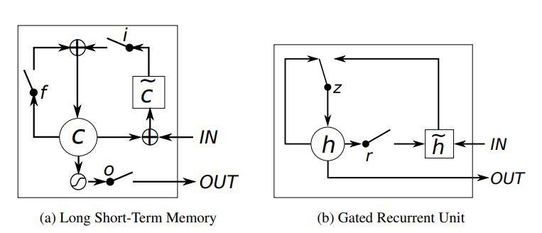
LSTM (Long Short-Term Memory，长短期记忆网络)和GRU (Gated Recurrent Unit，门控循环单元)都是循环神经网络(Recurrent neural networks, rnn)中用于序列建模的循环单元。

与GRU相比，LSTM具有更复杂的架构，有三个门:输入门、遗忘门和输出门。这些门控制信息流，并帮助LSTM在长序列中保留和忘记信息。

另一方面，GRU的架构更简单，有两个门:更新门和重置门。更新门控制信息流，而重置门决定要忘记多少过去的信息。

由于其额外的门，LSTM通常被认为更强大，能够捕获序列中的长期依赖关系。然而，GRU具有更少的参数和更低的计算成本，使其更适合于较小的数据集或实时应用。
## Evaluation
三个unit:LSTM units, GRUs,tanh units
在序列模型上比较，序列模型目标是学习一个序列的分布，在给定一个训练序列的集合下，计算它的最大似然估计：
$$
\max _{\boldsymbol{\theta}} \frac{1}{N} \sum_{n=1}^N \sum_{t=1}^{T_n} \log p\left(x_t^n \mid x_1^n, \ldots, x_{t-1}^n ; \boldsymbol{\theta}\right)
$$

任务1：复音音乐
数据集：Nottingham, JSB Chorales, MuseData and Piano-midi

任务2：语音信号预测
数据集：Ubisoft提供的内部语音信号模型数据集
## Conclusion
就音乐数据集而言，GRU训练得更快，参数更新也快。对Ubisoft而言，尽管tanh-RNN更新需要的计算量更小，但是模型没有取得更好的效果。
新型的门单元的比传统的循环单元表现更优，首先速度经常更快，最终的解更佳。但循环单元门的效果有劣取决于数据集和与之对应的任务,两个模型性能相近。

## References
Gers F A, Schmidhuber J, Cummins F. Learning to forget: Continual prediction with LSTM[J]. Neural computation, 2000, 12(10): 2451-2471.

Cho K, Van Merriënboer B, Bahdanau D, et al. On the properties of neural machine translation: Encoder-decoder approaches[J]. arXiv preprint arXiv:1409.1259, 2014.

----------
# 3.End-to-end Sequence Labeling via Bi-directional LSTM-CNNs-CRF #
ACL2016
Ma X, Hovy E. End-to-end sequence labeling via bi-directional lstm-cnns-crf[J]. arXiv preprint arXiv:1603.01354, 2016.
## Summary

提出了一个受益于单词级(word)和字符级(character)表示的网络架构，通过组合双向LSTM，CNN和CRF。
在两个经典的NLP任务上对模型给出了实验性的评估
端到端的模型上取得了state of the art 的效果,POS 标记准确率为 97.55%，NER 准确率为 91.21%。

## Research Objective(s)

目标是为序列标记任务提出和评估深度学习架构，特别是使用双向LSTM、CNN和CRF模型的组合。旨在通过利用机器学习和深度学习技术来应对序列标记任务的挑战，例如大量的词汇类别和对手工制作功能的需求。

## Background / Problem Statement

传统方法:大部分传统的高效模型是线性统计模型，包括HMM，CRF等。

存在问题：
非常依赖手工特征（hand-craft features）
任务相关的资源
这导致models difficult to adapt to new tasks or new domains.

近期方法:近些年有一些非线性神经网络模型用词向量（Word Embedding）作为输入，颇为成功。有前馈神经网络、循环神经网络（RNN）、长短期记忆模型（LSTM）、GRU，取得了很有竞争力的结果。

存在问题：
把词向量作为参数而不是取代手工特征，如果仅依赖词向量，效果将变得很差。

## Method(s)
用Character-level CNN获得词表示。
表示和事先训练好的词向量拼接起来，输入Bi-directional LSTM，得到每个状态的表示。注意，BLSTM的输入和输出都过了Dropout层
输出输入CRF层，最终预测。
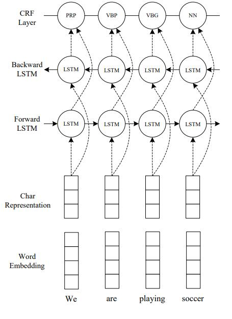
step1：CNN获取Character-level 的词表示(另一个word-level级别的表示用已经训练好的glove-100d的词向量)
step2：将step1中CNN获得的字符级的嵌入和训练好的word embedding的字级别的嵌入联合输入到BLSTM，以获得过去和未来的上下文信息。
step3：用CRF进行标注，联合解码输出最佳序列标注
最后将BLSTM的输出作为CRF的输入
## Evaluation
任务：POS 标记和 NER。
POS数据集:Penn Treebank (PTB) (Marcus et al., 1993) 的 Wall Street Journal (WSJ) 部分
NER数据集 CoNLL 2003 共享任务（Tjong Kim Sang 和 De Meulder，2003）的英文数据

实验设置
**Word Embeddings**
对比的词向量的dimensionality、训练语料不同

## Conclusion
BLSTM-CNN模型显著优于BLSTM模型，表明字符级表示对于语言序列标注任务很重要。通过为联合解码添加CRF层，在所有指标上都取得了比BLSTM-CNN模型在POS标记和NER上的显着改进。这表明联合解码标签序列可以显著提高神经网络模型的最终性能.

## Notes

## References
Jeffrey Pennington, Richard Socher, and Christopher Manning. 2014. Glove: Global vectors for word representation. In Proceedings of EMNLP-2014, pages 1532–1543, Doha, Qatar, October.

另一篇：Chiu J P C, Nichols E. Named entity recognition with bidirectional LSTM-CNNs[J]. Transactions of the association for computational linguistics, 2016, 4: 357-370.

----------
4.Sequence to Sequence Learning with Neural Networks
==
{Sutskever I, Vinyals O, Le Q V. Sequence to sequence learning with neural networks[J]. Advances in neural information processing systems, 2014, 27.
## Summary

提出了一种通用的端到端序列学习方法，它对序列结构做出了最小化的假设。
使用了一个多层的长短期记忆网络（LSTM）将输入序列映射成一个固定维度的向量，然后再用另外一个深层LSTM将这个向量解码成目标序列。
LSTM还学习到了对单词顺序较为敏感，学习到了对积极和消极语言相对不变的合理的短语和句子。

作者发现通过颠倒原句子中的单词顺序能够显著提升LSTM的性能，因为这样做会在源语句和目标句子之间引入许多短期依赖关系，这使得优化问题更容易。

## Research Objective(s)

研究目标是开发一个能够从单词的字符级别和句子的上下文中同时捕捉信息的序列标注模型。

## Background / Problem Statement

虽然传统的DNN神经网络拟合效果很好，但是只能应用于输入和目标可以用固定维度向量进行合理编码的问题上，而无法在机器翻译上取得很好的效果。即DNN在序列-序列的问题上效果不好，因此提出了Sequence to Sequence。

## Method(s)

解决问题的思路：先用一层LSTM读入源序列，逐步获得大量维度固定的表示向量，然后用另一层LSTM从向量中提取出目标序列。第二层LSTM本质上是一个语言模型。由于输入和输出之间存在相当大的时间延迟，所以使用LSTM对具有长期时间依赖性的数据进行训练.
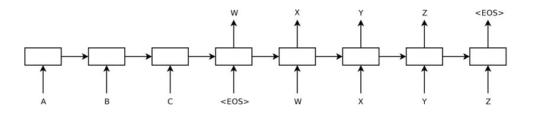
先读入源序列"ABC"，遇到结束符"“停止，然后输出目标序列"WXYZ”。其中有一个小策略，LSTM是反过来读取输入语句的，因为这样做可以引入更多的短期依赖，从而使优化更容易。

## Evaluation
数据集:WMT’14英法数据集
词汇表：源语言中使用了160000个最常用词，在目标语言中使用了80000个最常用词。每一个词汇表外的单词都被替换为一个特殊的“UNK”标记。

train：
- 并行化训练，使用一个8-GPU的机器并行化我们的模型。LSTM的每一层都在不同的GPU上执行，并在计算完成后立即将其激活传递给下一层GPU /层
- 确保小批量中所有句子的长度大致相同，从而提高了2倍的速度
- 使用beam search的搜索方法，提高模型效果
- 颠倒源序列中词的顺序

分别测试了LSTM、将LSTM与SMT系统结合在WMT14的英法语测试集(ntst14)上的性能
BLEU
## Conclusion

①LSTM可以优于一个基于SMT的标准系统。如果有足够的训练数据，它应该可以很好地解决许多其他序列学习问题。
②颠倒源语句中单词获得的改善程度很大。找到一个具有最多短期依赖性的问题编码会使学习问题更加简单。
③LSTM能够正确翻译非常长的句子。我们认为由于记忆有限，LSTM在长句上会失败。但是在反向数据集上训练的LSTM翻译长句几乎没有困难。
④我们证明了一种简单、直接且相对未优化的方法可以优于成熟的SMT系统。
LSTM还学习对词序敏感、对主动语态和被动语态相对不变的敏感短语和句子表征。

## Notes
优点：
- 首次使用一种端到端的学习方法，解决了DNN无法用于序列-序列的问题。
- 提出了Encoder-Decoder的模型框架，Encoder将输入序列映射为固定维度的向量，Decoder将固定维度的向量映射为序列。
- 非常适用于机器翻译领域，取得了当时用大型神经网络来实现机器翻译的最佳结果。
- 还有优化空间。加入Attention结构效果会更好。

缺点：
- 时间复杂度过高，在时间方面不如Transformer模型。
- 生成输出与输入文本之间长度匹配问题。
- 需要大量数据集才能实现较高性能。
- 推断速度慢。

## References
Gehring J, Auli M, Grangier D, et al. Convolutional sequence to sequence learning[C]//International conference on machine learning. PMLR, 2017: 1243-1252.

----------
5.Hierarchical Attention Networks for Document Classification
==
{Yang Z, Yang D, Dyer C, et al. Hierarchical attention networks for document classification[C]//Proceedings of the 2016 conference of the North American chapter of the association for computational linguistics: human language technologies. 2016: 1480-1489.}
## Summary

提出了一种用于文本分类的层次注意力网络；
该网络受限构建句子的表示，然后将它们聚合成文档表示；
该网络在单词和句子级别应用了两个级别的注意力机制；

## Research Objective(s)
提出一种用于文档分类的分层注意力网络。

## Background / Problem Statement

文本分类是自然语言的基础任务之一，研究者也开始使用基于深度学习的文本分类模型
虽然深度学习的文本分类模型取得非常好的效果，但是没有注意文档的结构，并且没有注意到文档中不同部分对于分类的影响程度不一样
为了解决这一个问题，提出了一种层次注意力网络来学习文档的层次结构，并且使用两种注意力机制学习基于上下文结构的重要性
与前人的区别是使用上下文来区分句子或单词的重要性，而不仅仅使用单个句子或单个的词

## Method(s)
模型结构
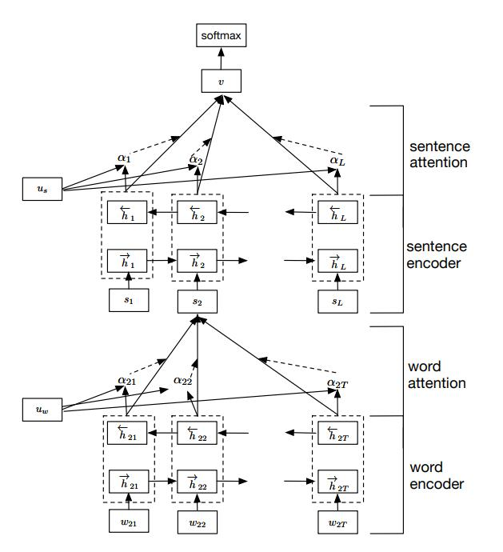
结构组成：
word encoder  （BiGRU layer）
word attention （Attention layer）
sentence encoder  （BiGRU layer）
sentence attention （Attention layer）

词层面的“注意力”机制
首先，将每个句子中的单词做embedding转换成词向量，然后，输入到双向GRU网络中，结合上下文的信息，获得该单词对应的隐藏状态输出
接着为了衡量单词的重要性，定义了一个随机初始化的单词层面上下文向量u_w计算其与句子中每个单词的相似度，然后经过一个softmax操作获得了一个归一化的attention权重矩阵a_it,代表句子i中第t个单词的权重,子的向量Si就可以看做是句子中单词的向量的加权求和
$$
\begin{aligned}
u_{i t} & =\tanh \left(W_w h_{i t}+b_w\right) \\
\alpha_{i t} & =\frac{\exp \left(u_{i t}^{\top} u_w\right)}{\sum_t \exp \left(u_{i t}^{\top} u_w\right)} \\
s_i & =\sum_t \alpha_{i t} h_{i t} .
\end{aligned}
$$
通过一个线性层对双向RNN的输出进行变换，然后通过softmax公式计算出每个单词的重要性，最后通过对双向RNN的输出进行加权平均得到每个句子的表示。

句层面的注意力模型和词层面的注意力模型类似。其计算公式如下所示：
$$
\begin{aligned}
\vec{h}_i & =\overrightarrow{\operatorname{GRU}}\left(s_i\right), i \in[1, L] \\
\overleftarrow{h}_i & =\overleftarrow{\operatorname{GRU}}\left(s_i\right), t \in[L, 1] \\
u_i & =\tanh \left(W_s h_i+b_s\right), \\
\alpha_i & =\frac{\exp \left(u_i^{\top} u_s\right)}{\sum_i \exp \left(u_i^{\top} u_s\right)}, \\
v & =\sum_i \alpha_i h_i,
\end{aligned}
$$
最后就是使用最常用的softmax分类器对整个文本进行分类

## Evaluation

数据集：
- Yelp’13、'14、'15
- IMDB
- Yahoo Answer
每个数据集合中80%的数据用作训练集合，10%的数据用作验证集合，剩余10%的集合用作测试集合， 评估指标为**Accuracy**

对比模型
- 线性模型
- SVM
- word-based CN
- Character-based CNN
- Conv/LSTM-GRNN
 
## Conclusion
strong conclusions：就准确性而言，拟议的用于文档分类的分层注意力网络的性能超过以前的方法。
注意力层的可视化表明，该模型可以有效地选择重要的单词和句子。

weak conclusions：模型可以处理复杂的跨句上下文，并且可以根据上下文忽略某些句子。但是，这是在可视化的背景下讨论的，没有得到实验数据的明确支持。

## Notes

- 对于文档分类，不是所有的词汇都与分类结果相关；相关的部分要参考词语间的上下文关系，而非仅仅是他们的独立表示。

- 使用两种级别的注意力机制（word和sentence级）来获取上下文信息以衡量单词和句子在不同上下文中的重要程度。

- 可视化思路，能展现Attention机制分别在sentence和word上的权重。
- 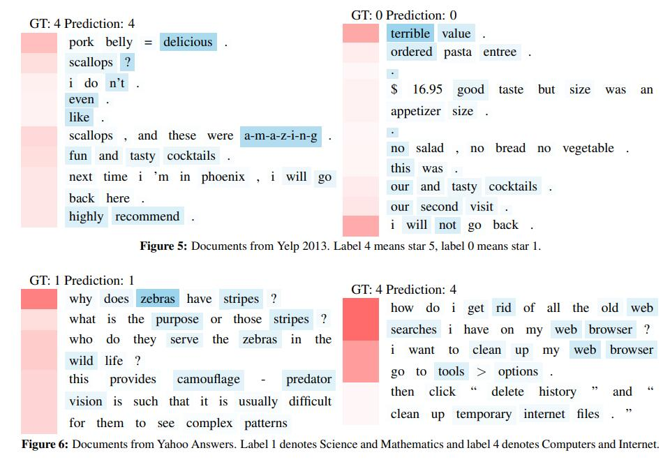

## References

1. A C-LSTM Neural Network for Text Classification( 2015, LSTM + CNN)
2.  Document Modeling with Gated Recurrent Neural Network for Sentiment Classification( 2015, hierarchical structure, 提供yelp, IMDB数据集)
3.  Character-level Convolutional Networks for Text Classification

6.Attention Is All You Need
==
{Vaswani, A., Shazeer, N., Parmar, N., Uszkoreit, J., Jones, L., Gomez, A. N., Kaiser, L., & Polosukhin, I. (2017). Attention Is All You Need. http://arxiv.org/abs/1706.03762}
## Summary

序列转换模型主要基于是复杂的循环结构的RNN和CNN架构，通过其中的编码器Encoder和解码器Decoder来实现。而本文提出的Transformer完全摒弃了之前的循环和卷积操作，完全基于注意力机制，拥有更强的并行能力，训练效率也得到较高提升。

## Background / Problem Statement

在Transformer提出以前，主流的NLP模型包括RNN、LSTM、GRU等，这些模型有以下缺点：

- 难以并行

- 时序中过早的信息容易被丢弃

- 内存开销大

由于这些网络都是由前往后一步步计算的，当前的状态不仅依赖当前的输入，也依赖于前一个状态的输出。即对于网络中的第个t状态，与前t-1个状态都有关，使得网络必须一步一步计算；当较为重要的信息在较早的时序中进入网络时，多次传播过程中可能保留很少甚至被丢弃；从另一角度来考虑，即使重要的信息没有被丢弃，而是随着网络继续传递，会造成内存的冗余，导致开销过大。

## Method(s)
Transformer的模型分为encoder和decoder两部分，即编码器和解码器两部分。对于原始输入(x1,x2,…,xn)，编码器将其转化为机器可理解的向量(z1,z2,…,zn)，解码器将编码器的输出作为输入，进而生成最终的解码结果(y1,y2,…,yn)。其模型结构如下图所示：
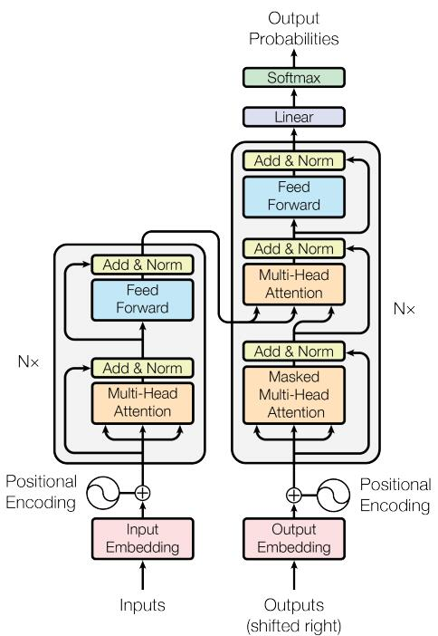

Transformer 中单词的输入表示 x由单词 Embedding 和位置 Embedding （Positional Encoding） 相加得到。
位置编码公式如下
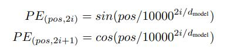
pos 表示单词在句子中的位置，d 表示 PE的维度 (与词 Embedding 一样)，2i 表示偶数的维度，2i+1 表示奇数维度 (即 2i≤d, 2i+1≤d)。

- 使 PE 能够适应比训练集里面所有句子更长的句子，假设训练集里面最长的句子为 20 个单词，当遇到 21 的句子，则使用公式计算的方法可以计算出第 21 位的 Embedding。

- 可以让模型容易地计算出相对位置，对于固定长度的间距 k，PE(pos+k) 可以用 PE(pos) 计算得到。因为 Sin(A+B) = Sin(A)Cos(B) + Cos(A)Sin(B), Cos(A+B) = Cos(A)Cos(B) Sin(A)Sin(B)。

Multi-attention（self attention）
在多头注意力机制中，首先将输入的查询（Query）、键（Key）和值（Value）通过不同的线性变换映射到多个空间。
$$
\operatorname{Attention}(Q, K, V)=\operatorname{softmax}\left(\frac{Q K^T}{\sqrt{d_k}}\right) V
$$
对每个映射后的查询、键和值，独立地计算注意力分数，通常是通过缩放点积注意力（Scaled Dot-Product Attention）来实现。
缩放点积注意力通过计算查询和键的点积，然后除以一个缩放因子（通常是键的维度的平方根），最后应用softmax函数来确定值的权重。
每个头的输出是其对应的值的加权和，然后这些输出被拼接起来，并通过另一个线性变换。
$$
\operatorname{Attention}(Q, K, V)=\operatorname{softmax}\left(\frac{Q K^T}{\sqrt{d_k}}\right) V
$$
前馈神经网络（FeedForward）
结构：
Transformer中的前馈神经网络通常是一个简单的两层线性变换网络，中间有一个ReLU激活函数。
第一层将输入映射到一个更高维的空间，第二层则将其映射回原始维度。
作用：
这个前馈网络对每个位置的表示进行独立处理，但是对于不同位置是相同的（即它不考虑序列中的位置信息）。增加了模型的非线性，使得模型能够学习更复杂的特征。
## Evaluation

测试了“英语-德语”和“英语-法语”两项翻译任务。使用论文的默认模型配置，在8张P100上只需12小时就能把模型训练完。本工作使用了Adam优化器，并对学习率调度有一定的优化。模型有两种正则化方式：1）每个子层后面有Dropout，丢弃概率0.1；2）标签平滑（Label Smoothing）。Transformer在翻译任务上胜过了所有其他模型，且训练时间大幅缩短。

## Conclusion
Transformer模型在机器翻译任务中表现出色，能够提供更高的质量和更快的训练速度。此外，模型在其他任务（如英语成分解析）上也表现出良好的泛化能力。

## Notes

Transformer的特性：

优点：
(1) 每一层的计算复杂度比较低
(2) 比较利于并行计算
(3) 模型可解释性比较高（不同单词之间的相关性有多大）
Transformer的设计最大的带来性能提升的关键是将任意两个单词的距离是1，这对解决NLP中棘手的长期依赖问题是非常有效的
缺点：
Transformer失去的位置信息其实在NLP中非常重要，而论文中在特征向量中加入Position Embedding也只是一个权宜之计，并没有改变Transformer结构上的固有缺陷。

7.BERT: Pre-training of Deep Bidirectional Transformers for Language Understanding
==
## Summary

当前的预训练模型主要分为基于特征和微调两大类，但它们大都基于单向的语言模型来进行语言学习表征，这使得许多句子级别的下游任务无法达到最优的训练效果。因此，本文提出了名为BERT的双向预训练表征模型，很大程度上缓解了单向模型带来的约束。同时，引入了“完形填空”和“上下句匹配”分别作为单词级别和句子级别的两大通用任务，对BERT模型进行训练。实验表明， BERT模型的应用使得当前的11个NLP任务均取得了SOTA的效果。

## Research Objective(s)

开发一种新的语言表示模型BERT，它通过深度双向训练，从无标记文本中提取语言特征，以改善各种自然语言处理任务的性能。

## Background / Problem Statement

在自然语言处理领域，现有的语言模型不足以充分利用双向语境信息。作者旨在解决这一问题，提高模型对于语言理解的深度和准确性。

## Method(s)

BERT，一种基于“Transformer”架构的模型，它使用“masked language model”(MLM)和“next sentence prediction”(NSP)两种预训练任务。这种方法是在先前的语言模型如OpenAI GPT和ELMo的基础上发展而来的。
BERT是基于Transformer的深度双向语言表征模型，**本质上是利用Transformer结构构造了一个多层双向的Encoder网络**
模型结构
-   BERT使用双向Transformer。OpenAI GPT使用从左到右的Transformer。ELMo使用独立训练的从左到右和从右到左lstm的连接来为下游任务生成特征。
- BERT和OpenAI GPT是一种**Fine-tuning**方法，而ELMo是一种**Feature-based**的方法。

针对不同的任务，BERT模型的输入可以是单句或者句对。**对于每一个输入的Token，它的表征由其对应的词表征（Token Embedding）、段表征（Segment Embedding）和位置表征（Position Embedding）相加产生**，如下图所示。
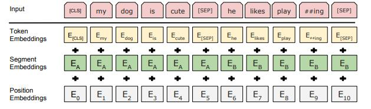
对于英文模型，使用了Wordpiece模型来产生Subword从而减小词表规模；对于中文模型，直接训练基于字的模型。
**模型输入需要附加一个起始Token，记为[CLS]，对应最终的Hidden State（即Transformer的输出）可以用来表征整个句子，用于下游的分类任务**。
模型能够处理句间关系。为区别两个句子，用一个特殊标记符[SEP]进行分隔，另外针对不同的句子，将学习到的Segment Embeddings 加到每个Token的Embedding上。
对于单句输入，只有一种Segment Embedding；对于句对输入，会有两种Segment Embedding。

MLM
通过随机掩盖一些词（替换为统一标记符**[MASK]**），**然后预测这些被遮盖的词来训练双向语言模型，并且使每个词的表征参考上下文信息**（**完型填空**）。这样做会产生两个缺点：
1.  会造成预训练和微调时的不一致，因为在微调时[MASK]总是不可见的；
2.  由于每个Batch中只有15%的词会被预测，因此模型的收敛速度比起单向的语言模型会慢，训练花费的时间会更长。对于第一个缺点的解决办法是，**把80%需要被替换成[MASK]的词进行替换，10%的随机替换为其他词，10%保留原词**。由于Transformer Encoder并不知道哪个词需要被预测，哪个词是被随机替换的，这样就强迫每个词的表达需要参照上下文信息。对于第二个缺点目前没有有效的解决办法，但是从提升收益的角度来看，付出的代价是值得的。

NSP
-   为了训练一个理解句子间关系的模型，引入一个下一句预测任务。这一任务的训练语料可以从语料库中抽取句子对包括两个句子A和B来进行生成，**其中50%的概率B是A的下一个句子，50%的概率B是语料中的一个随机句子。**NSP任务预测B是否是A的下一句。NSP的目的是获取句子间的信息，这点是语言模型无法直接捕捉的。
-   Google的论文结果表明，这个简单的任务对问答和自然语言推理任务十分有益，但是后续一些新的研究发现，去掉NSP任务之后模型效果没有下降甚至还有提升。我们在预训练过程中也发现NSP任务的准确率经过1-2个Epoch训练后就能达到98%-99%，去掉NSP任务之后对模型效果并不会有太大的影响。

## Evaluation
本文将BERT模型迁移至11个NLP基准任务上进行了微调训练，均取得了SOTA的效果。另外，为了探究模型的不同组成部分对整体性能的影响，本文还进行了若干消融实验，对BERT的预训练任务、模型规模等要素进行了实验评估，充分论证了双向模型的重要性。

评估方法包括在多个标准的自然语言处理任务上测试BERT的性能，如GLUE、MultiNLI和SQuAD等。实验设置涉及使用不同大小的BERT模型进行对比。

## Conclusion
实验结果显示BERT在所有测试任务中取得了新的最佳性能。
提升了GLUE分数7.7%，Multiv提升了4.6%，SQuAD v1.1任务上提升了1.5%，SQuAD v2.0任务提升了5.1%。
BERT显著提高了自然语言处理任务的性能。强有力的结论是双向预训练对于理解语言非常重要。相对较弱的结论可能涉及BERT在特定任务上的适用性，因为这些可能需要进一步的专门调整和验证。

## Notes

-   贡献
    -   证明深度双向预训练语言模型的重要性，
    -   采用pre-training fine-tuning的结构，预先训练的表示免去了许多工程任务需要针对特定任务修改体系架构的需求。 BERT是第一个基于微调的表示模型，它在大量的句子级和token级任务上实现了最先进的性能，强于许多面向特定任务体系架构的系统。直接带动了pretrain+finetune的预训练模型的时代
    -   BERT刷新了许多NLP任务的性能记录。

## References

[Deep Contextualized Word Representations](https://aclanthology.org/N18-1202) (Peters et al., NAACL 2018)

8.RoBERTa: A Robustly Optimized BERT Pretraining Approach
==
## Summary

对BERT预训练进行了详细研究，识别了关键的设计选择和训练策略，显著提高了性能。作者引入了RoBERTa，这是BERT的优化版本，在主要基准测试中的性能超过了现有模型，而无需依赖多任务微调或额外数据。作者强调了训练持续时间、批量大小、数据集大小和掩码模式的重要性，揭示了这些经常被忽视的因素对模型性能至关重要。

## Research Objective(s)

通过仔细检查各种超参数和训练数据大小，增强对BERT预训练的理解，并提高其性能。

## Background / Problem Statement

语言模型预训练的复杂性和计算成本，以及由于数据集和超参数的变化，比较不同模型的挑战。问题是确定BERT训练过程中最有影响的因素，以优化其性能。

## Method(s)
- 1）模型架构的优化
RoBERTa的基本架构和BERT相同，超参数也基本采用BERT原文的超参数，除了warmup步数(w)和peak learning rate(peak lr)。warm up，即模型训练最开始的时候一般不稳定，所以令学习率lr很小，尤其是针对test数据集上损失较高的情况可采用warm up策略，防止基于mini-batch的训练过早的过拟合。在一段时间后模型的lr会趋于稳定达到peak lr然后再下降。再次下降是因为模型平稳之后不希望再被mini-batch的数据影响太多。BERT原文采用的w为10000步，peak lr为1e-4，而RoBERTa（large）采用w为30K，peak lr为4e-4。除此之外，RoBERTa选择Adam的β2 = 0.98，当batch size比较大的时候更加稳定
RoBERTa则在整个过程中都采用max length=512。

- 2）数据集的增强
文章认为预训练的数据集越大，下游任务表现越好，据此，文章尽可能地搜集更多数据进行预训练，从五个不同领域的英语语料库中收集共160GB的数据集。

- 3）掩码方法的优化
为了避免每个epoch模型采用相同的掩码，文章提出
1-静态掩码策略（static masking）：将训练数据复制10份，每个句子都采用10次不同的mask，这样40epochs之后，每个句子都有4次相同的mask。
2-动态掩码策略（dynamic masking）：每个句子每次用于训练时均生成不同的mask

- 4）训练目标的调整
**Segment-pair+NSP**：采用NSP损失。每个输入都是一对文本，每个文本可能包含多个自然语句，总长度不超过512。
**Sentence-pair+NSP**：采用NSP损失。每个输入都是一对句子，一般来说每个句子的长度远小于512，从而在该实验中增加了batch size以保证每次训练的token数和其它任务相近。
**Full-Sentences**：不采用NSP损失。每个输入都是从一个或者多个文档中连续采样的完整句子，满足总长度不超过512。如果当前采样到某文档的结尾，但句子总长度低于512，则从其它文档基于采样句子增加至当前文档，两个文档之间用特殊分隔符表示。
**Doc-Sentences**：不采用NSP损失。类似Full-Sentences，只是不跨越文档。但不

- 5）Batch size的提升
实验效果如下表。可以看到batch size为8K时，模型的困惑度(ppl)最高，且准确率也有提升，故RoBERTa采用batch size为8K。
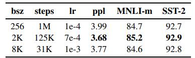
- 6）编码方式的修改
-文章选择用基于字节的编码方式(byte-level BPE)对文本进行编码。
## Evaluation

比较了RoBERTa与BERT和其他模型的性能。
参数设置上基本等同于bert，除了Peak learning rate和warmup steps。max-length=512，和bert不同的是，roberta没有像bert一样为了加速训练，90%的更新时使用缩短后的序列（max-length=128），而是用完整长度的序列。

数据

Robert的实验中共涉及了5种不同领域的英文语料，共160G：

1）BOOKCORPUS+English WIKIPEDIA (Bert的语料)。16GB

2) CC-NEWS CommonCrawl News dataset的英文部分。76GB

3）OPENWEBTEXT WebText语料库的开源再造（来自于Reddit）。38GB

4） STORIES 也来自于CommonCrawl，故事风格的文本子集。31GB

评价指标：GLUE， SQuAD，RACE

## Conclusion

BERT显著提高了自然语言处理任务的性能。强有力的结论是双向预训练对于理解语言非常重要。文章通过大量数值试验证明，BERT仍有很多优化的空间，包括超参数的调节、数据量的增加和训练目标的调整等。RoBERTa在包括QA、SST、NLI等下游任务中达到了SOTA表现。同样，未来也可以通过增强数据和模型参数量等方式对RoBERTa进行进一步的优化。

## Notes

本文贡献：

出了一套重要的BERT设计选择和训练策略，并引入了能够提高下游任务绩效的备选方案

使用了一个新的数据集，CCNEWS，并确认使用更多的数据进行预训练进一步提高了下游任务的性能

训练改进表明，在正确的设计选择下，masked language model的预训练可以与所有其他最近发表的方法相媲美

9.DeBERTa: Decoding-enhanced BERT with Disentangled Attention
==
## Summary

文章提出了两种改进BERT预训练的方法：
第一种是注意解耦机制，该机制将一个单词的表征由单词的内容和位置编码组成，并使用解耦矩阵计算单词之间在内容和相对位置上的注意力权重；
第二种是引入一个增强的掩码解码器(EMD)，它取代原有输出的Softmax来预测用于MLM预训练的被mask掉的token。使用这两种技术，新的预训练语言模型DeBERTa在许多下游NLP任务上的表现都优于RoBERTa和BERT。DeBERTa这项工作展示了探索自注意的词表征解耦以及使用任务特定解码器改进预训练语言模型的潜力。

## Research Objective(s)

作者的目标是通过提出一种新的模型架构DeBERTa，通过解耦注意力和增强的掩码解码器增强BERT和RoBERTa模型，以提高自然语言处理（NLP）任务的性能。

## Background / Problem Statement

Transformer已成为神经语言建模最有效的神经网络结构。与按顺序处理文本的递归神经网络（RNN）不同，Transformers应用自注意并行计算输入文本中的每个单词的注意权重，衡量每个单词对另一个单词的影响，因此在大规模语言模型(PLM)训练中允许比RNN更多的并行化。自2018年以来，出现了一系列基于Transformer的大规模预训练语言模型，如GPT，BERT，RoBERTa，UNILM，ELECTRA，T5，ALUM，StructBERT，ERNIE。
解决现有基于Transformers的预训练语言模型（PLMs）在NLP任务中的局限性。作者旨在提高模型预训练的效率和自然语言理解（NLU）及生成（NLG）任务的性能。

## Method(s)

**自注意力解耦机制**

用2个向量分别表示content 和 position，即word本身的文本内容和位置。word之间的注意力权重则使用word内容之间和位置之间的解耦矩阵。这是因为word之间的注意力不仅取决于其文本内容，还依赖于两者的相对位置。比如，对于单词"deep" 和 单词"learning"，当二者一起出现时，则它们之间的关系依赖性要比在不同的句子中出现时强得多。
给定一个文本序列，对于第i个token分别用Hi和Pij表示文本向量和相对j位置的位置向量。那么token i，j之间的交叉注意力分数可以分解成4个部分：
$$
\begin{aligned}
A_{i, j} & =\left\{\boldsymbol{H}_{\boldsymbol{i}}, \boldsymbol{P}_{\boldsymbol{i} \mid \boldsymbol{j}}\right\} \times\left\{\boldsymbol{H}_{\boldsymbol{j}}, \boldsymbol{P}_{\boldsymbol{j} \mid \boldsymbol{i}}\right\}^{\top} \\
& =\boldsymbol{H}_{\boldsymbol{i}} \boldsymbol{H}_{\boldsymbol{j}}^{\top}+\boldsymbol{H}_{\boldsymbol{i}} \boldsymbol{P}_{\boldsymbol{j} \mid \boldsymbol{i}}^{\top}+\boldsymbol{P}_{\boldsymbol{i} \mid \boldsymbol{j}} \boldsymbol{H}_{\boldsymbol{j}}^{\top}+\boldsymbol{P}_{\boldsymbol{i} \mid \boldsymbol{j}} \boldsymbol{P}_{\boldsymbol{j} \mid \boldsymbol{i}}^{\top}
\end{aligned}
$$

token  i,j之间的注意力权重可以由内容和位置之间的解耦矩阵组成，
解耦的最终结果是4种注意力机制：

-   内容-内容（content-to-content）
-   内容-位置（content-to-position）
-   位置-内容（position-to-content）
-   位置-位置（position-to-position）

**增强的掩码解码器**
DeBERTa使用MLM进行预训练，训练一个模型使用MASK周围的单词来预测被MASK的单词应该是什么。其使用上下文词的内容和位置信息。解耦注意机制已经考虑了上下文单词的内容和相对位置，但没有考虑这些单词的绝对位置，在许多情况下，这些位置对预测也很重要。
在DeBERTa中，作者在所有Transformer层之后，但在softmax层之前进行合并，以进行MASK预测。通过这种方式，DeBERTa捕获所有Transformer层中的相对位置，并且在解码MASK时仅使用绝对位置作为补充信息。因此，DeBERTa的解码组件称为增强型掩码解码器（EMD）

**虚拟对抗训练方法 **
DeBERTa预训练里面引入的对抗训练叫SiFT，它攻击的对象不是word embedding，而是embedding之后的layer norm。
规模不变微调(Scale-invariant-Fine-Tuning SiFT)算法一种新的虚拟对抗训练算法，用于模型的微调。虚拟对抗训练是一种改进模型泛化的正则化方法。 它通过对抗性样本提高模型的鲁棒性，对抗性样本是通过对输入进行细微扰动而创建的。 对模型进行正则化，以便在给出特定于任务的样本时，该模型产生的输出分布与该样本的对抗性扰动所产生的输出分布相同。

对于之前的NLP任务，一般会把扰动应用于单词嵌入，而不是原始单词序列。 但是嵌入向量值的范围在不同的单词和模型之间有所不同。 对于具有数十亿个参数的较大模型，方差会变大，从而导致对抗训练有些不稳定。

受层归一化的启发，文章提出了SiFT算法，该算法通过应用扰动的归一化词嵌入来提高训练稳定性。 即在实验中将DeBERTa微调到下游NLP任务时，SiFT首先将单词嵌入向量归一化为随机向量，然后将扰动应用于归一化的嵌入向量。 实验表明，归一化大大改善了微调模型的性能。
## Evaluation
**Large和Base**
**消融研究**
为量化不同部分在 DeBERTa 中的贡献程度，文章进行了消融研究。文章设计了三种DeBERTa变体：

EMD：没有 EMD 的 DeBERTa 模型。
C2P：没有content-to-position这一项的 DeBERTa 模型。
P2C：没有position-to-content这一项的 DeBERTa 模型。 由于 XLNet 也使用相对位置，所以该模型近似等同于XLNet+EMD。

## Conclusion
RoBERTa 和 RoBERTa-ReImp base，在所有四个基准数据集上的表现相似。因此，RoBERTa-ReImp 作为一个坚实的baseline是可靠的。
缺失DeBERTa中的任何一个部分，在所有基准测试的性能都会下降。比如，去掉 EMD(即-EMD)，那么将带来以下的性能下降：
RACE下降1.4% (71.7% vs 70.3%)
SQuAD v1.1下降 0.3% (92.1% vs 91.8%)
SQuAD v2.0下降1.2%（82.5% vs 81.3%）
MNLI-m/mm分别下降0.2% (86.3% vs 86.1%)和0.1% (86.2% vs 86.1%)。
类似地，删除content-to-position 或position-to-content都会导致在所有基准任务下的性能下降。正如预期的那样，同时去掉content-to-position 和position-to-content则会导致更严重的性能退化。

## Notes

DeBERTa V1 相比 BERT 和 RoBERTa 模型的改进：

-   两种技术改进：
    -   注意力解耦机制
    -   增强的掩码解码器
-   新的微调方法：虚拟对抗训练方法(SiFT)

10.DeBERTaV3: Improving DeBERTa using ELECTRA-Style Pre-Training with Gradient-Disentangled Embedding Sharing
==
## Summary

文章介绍了一种新的预训练语言模型DeBERTaV3，通过替换原始DeBERTa模型中的掩码语言建模（MLM）任务为更有效的替换标记检测（RTD）任务来改进。文章分析了ELECTRA中的标准嵌入共享对训练效率和模型性能的负面影响，并提出了一种新的梯度解耦嵌入共享方法，旨在提高训练效率和预训练模型的质量。DeBERTaV3在多个下游自然语言理解（NLU）任务中展现出卓越性能，如GLUE基准上的DeBERTaV3 Large模型达到91.37%的平均分数，超过DeBERTa和ELECTRA，设定了类似结构模型的新标准。此外，多语言模型mDeBERTaV3也在XNLI等基准测试中实现显著提升。

## Research Objective(s)

作者的研究目标是通过改进原始DeBERTa模型，探索更高效的预训练语言模型方法。通过引入替换标记检测（RTD）和新的梯度解耦嵌入共享方法，提升模型在自然语言理解任务中的性能和训练效率。

## Background / Problem Statement

作者提出，尽管通过增加参数规模可以提升预训练语言模型（PLM）的能力，更重要的是探索更为高效的方法来构建具有较少参数和计算成本的PLM，同时保持高模型容量。文章针对的主要问题是如何提升预训练模型的效率和性能。

## Method(s)
DeBERTaV3
1. 生成器的宽度和鉴别器一样但是深度只有一半
2. DeBERTaV3 significantly outperforms DeBERTa, i.e., +2.5% on the MNLI-m accuracy and +3.8% on the SQuAD v2.0 F1.
3. MLM和RTD：相当于是多任务学习，但是差异过大，导致将embedding推到不同的方向
不同的嵌入共享方法：
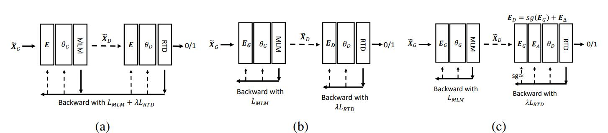
4. MLM：token->相同语义放到一起->找到相同语义的词
5. RTD: token->从相同语义里面来区分相似的token->分类精度

## Evaluation
1. 大模型对比
low resource task提升大，RTE+4.4%，CoLA+4.8%，说明DeBERTav3在同样的数据情况下，更有效。sts任务提升不大.
2. 小模型对比
base模型，MNLI-m任务：90.6 vs 84， squad： 88 vs 76.3
small：+6.4%提升
3. 跨语言模型
作者通过在多个NLU基准测试中评估DeBERTaV3模型来验证方法的有效性，例如GLUE、MNLI和SQuAD v2.0。结果显示，DeBERTaV3在多数任务中取得了显著提升，其中DeBERTaV3 Large模型在GLUE基准测试中的平均分数超过了之前的最佳模型。此外，多语言模型mDeBERTaV3在XNLI测试中也展现了较强的跨语言迁移能力。

## Conclusion

通过结合DeBERTa和ELECTRA的优势并引入GDES，可以显著提高PLM的训练效率和性能。DeBERTaV3模型在多种NLU任务中都设定了新的性能标准，证明了改进预训练语言模型的巨大潜力。

## References
Kevin Clark, Minh-Thang Luong, Quoc V. Le, and Christopher D. Manning. ELECTRA: Pre-training text encoders as discriminators rather than generators. In ICLR, 2020.

11.LoRA: Low-Rank Adaptation of Large Language Models
==
## Summary

论文提出了一种新的大型语言模型调整方法，名为低秩适应（LoRA）。LoRA 的关键思想是在保持预训练模型权重不变的情况下，通过注入可训练的秩分解矩阵到 Transformer 架构的每一层中，显著减少用于下游任务的可训练参数数量。使用 GPT-3 175B 作为例子，LoRA 能够将可训练参数数量减少 10,000 倍，GPU 内存需求减少 3 倍。与完全微调 GPT-3 175B 相比，LoRA 在训练参数更少的情况下，模型质量上相当或更好，

## Research Objective(s)

提出一种新的大型语言模型调整方法，以提高训练效率并减少部署成本，同时保持或提升模型性能。

## Background / Problem Statement

为解决微调大规模语言模型到不同领域和任务的挑战，已有多种方案，比如部分微调、使用adapters和prompting。但这些方法存在如下问题：
Adapters引入额外的推理延迟 (由于增加了模型层数)
Prefix-Tuning难于训练，且预留给prompt的序列挤占了下游任务的输入序列空间，影响模型性能
大型预训练语言模型虽然在多种下游任务中表现出色，但它们的完全微调（即重新训练所有模型参数）在实际应用中变得越来越不可行。特别是对于像 GPT-3 这样的大型模型，部署独立的微调模型实例（每个都有 175B 参数）成本过高。

## Method(s)
模型方法
$$
\max _{\Theta} \sum_{(x, y) \in \mathcal{Z}} \sum_{t=1}^{|y|} \log \left(p_{\Phi_0+\Delta \Phi(\Theta)}\left(y_t \mid x, y_{<t}\right)\right)
$$
在原始预训练语言模型（PLM）旁边增加一个旁路，做一个降维再升维的操作，来模拟所谓的内在秩。
训练的时候固定PLM的参数，只训练降维矩阵A与升维矩阵B。
模型的输入输出维度不变，输出时将BA与PLM的参数叠加。
用随机高斯分布初始化A，用0矩阵初始化B，保证训练的开始此旁路矩阵依然是0矩阵。
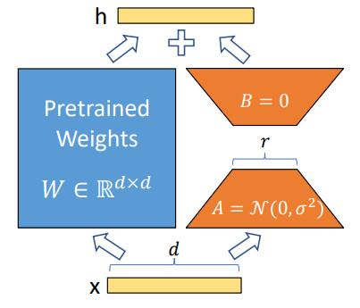
如上图所示们对于某个线性层而言，左边是模型原有的参数，在训练过程中是冻结不变的，右边是lora方法增加的低秩分解矩阵。训练过程中，优化器只优化右边这一部分的参数，两边的矩阵会共用一个模型的输入，分别进行计算，最后将两边的计算结果相加作为模块的输出。不同于之前的参数高效微调的adapter，adapter是在模块的后面接上一个mlp，对模块的计算结果进行一个后处理，而lora是和模块的计算并行的去做一个mlp，和原来的模块共用一个输入。

1. 低秩参数化的更新矩阵
低秩矩阵是指其秩（即线性无关的行或列的最大数目）远小于矩阵的维度。在LoRA中，一个高维权重矩阵的更新不是直接修改整个矩阵，而是通过两个较小的矩阵的乘积来表示。这两个小矩阵的乘积构成了原始矩阵的一个低秩近似。
例如，假设有一个d×d的权重矩阵，直接学习或调整这个矩阵需要
d^2个参数。但是，如果使用两个d×r和r×d的矩阵（其中r远小于d）的乘积来近似这个更新，那么只需要2dr个参数，大大减少了参数量。
2. 将LoRA应用于Transformer
将LoRA应用于Transformer时，我们不是直接修改Transformer的权重，而是引入额外的低秩矩阵来调整这些权重。这些低秩矩阵在原始Transformer模型的基础上提供了微调的能力，使得模型可以适应新的任务或数据集，同时保持了大部分预训练权重不变。
在实践中，这意味着对于Transformer中的每个权重矩阵（例如，在自注意力层和前馈网络中），我们引入一对低秩矩阵。这些矩阵在训练过程中学习，以优化模型在特定任务上的表现。由于这些矩阵的秩较低，因此增加的参数数量相对较少，使得LoRA成为一种高效的微调方法。

## Evaluation

作者通过在不同的下游任务（如 RoBERTa、DeBERTa、GPT-2 和 GPT-3）上评估 LoRA 的性能来验证其有效性。

## Conclusion

研究表明，LoRA 是一种有效的大型语言模型适应策略，可以显著减少可训练参数数量和GPU内存需求，同时保持高模型质量。这使得大型模型的部署更加可行，特别是在资源受限的情况下。

**对rank的选择**
实验结果显示，对于一般的任务，r=1,2,4,8就足够了。而一些领域差距比较大的任务可能需要更大的r。
## Notes
总的来说，基于大模型的内在低秩特性，增加旁路矩阵来模拟full finetuning，LoRA是一个能达成lightweight finetuning的简单有效的方案。目前该技术已经广泛应用于大模型的微调，如Alpaca，stable diffusion+LoRA，而且能和其它参数高效微调方法有效结合，例如 State-of-the-art Parameter-Efficient Fine-Tuning (PEFT)

