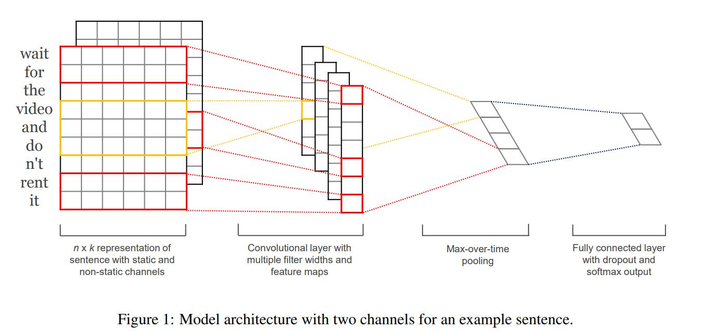
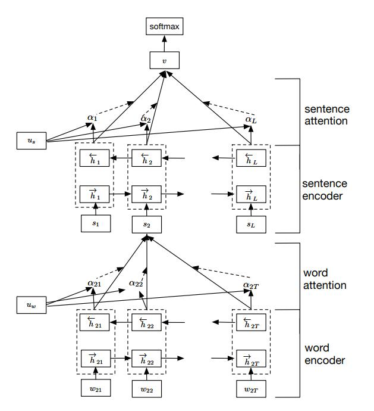
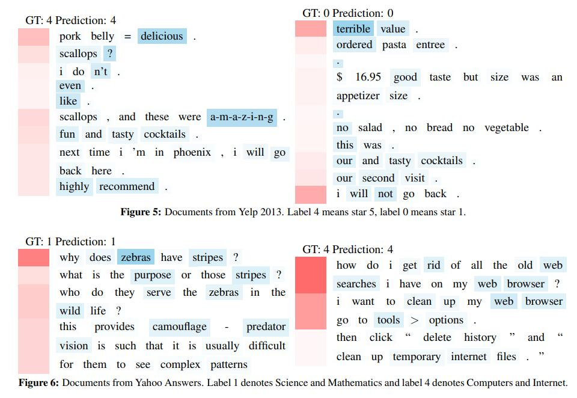

1.Convolutional Neural Networks for Sentence Classification
===

{2014}, {Yoon Kim}

{Kim Y. Convolutional Neural Networks for Sentence Classification[J].}

## Summary
1.具有少量超参数调整和静态向量的简单CNN在多个基准测试中实现了出色的结果
2.通过微调学习任务特定的向量可以进一步提高性能
3.对体系结构的简单修改，以允许通过具有多个通道来使用预训练和任务特定的矢量
## Research Objective(s)

作者的研究目标是研究使用卷积神经网络进行句子级分类任务，并探索在这一任务中使用预训练词向量的效果。目标是通过进行一系列的实验，评估使用静态词向量的简单CNN模型在多个基准测试上的表现，并探讨任务特定的微调词向量与静态词向量相结合的可能性。另外，还研究了使用dropout进行正则化以及限制权重向量的L2范数的方法

## Background / Problem Statement
深度学习在计算机视觉，语音识别等领域拥有了显著的成果。近年来在自然语言处理中，主要包括词向量的研究，以及训练文本，将文本转化为词向量进行进一步的文本分类。将之前稀疏的1-V（词典的大小）转化为特定维度的向量，相当于初步将文本中的情感特征加在了词向量中。通过词向量的转化，语义相近的词距离也相近，比如余弦距离。

## Method(s)

如图所示，每个句子中的词（中文需要先进行分词）转化为词向量，词向量的维度为k，如果一个句子中的词个数为m，则该句最终表示为 m×k 的词向量矩阵。假设文档中最长的句子中的词个数为n，则 小于n 的句子填充为m。最终得到的词向量矩阵为 n×k。
1维卷积器的长度h分别为3，4，5。卷积器的尺度为3×k，4×k, 5×k。
卷积器的数量分别为n_0, n_1, n_2，在实验中，都取100。
3种卷积器与矩阵分别做卷积，得到（n-h+1）×1×100的矩阵, 卷积过程如公式： 
$$
c_i=f\left(\mathbf{w} \cdot \mathbf{x}_{i: i+h-1}+b\right) .
$$
（n-h+1）×1×100的矩阵然后对列最大值池化，得到1×1×100， 即1×100的向量，最终将3中卷积器连接在一起，得到1 ×300的向量。
将1×300的词向量经过全连接层，做softmax二分类。
在全连接神经网络中用到了dropout去除过拟合，dropout率为0.5，l2正则为0.3，最小batch为50。
通过反向随机梯度下降，训练模型参数。
## Evaluation

1.词向量是随机生成的特度维度的向量。

2.词向量是使用预先训练好的谷歌word2vec词向量。

3.词向量作为模型的参数不断调整。

4.多通道：2和3相结合，在卷积层，将两通道结果值相加
结果分析：
CNN-rand效果并不是特别显著，CNN-static效果突然上升，效果显著。说明使用预训练的词向量对结果起到了很大的作用。
单通道与多通道：本来希望多通道的效果更好，多通道能够防止过拟合，实际上两种方法的效果在特定的数据集中效果有优有劣。
CNN模型在7个任务中的4个上超过了现有的SOTA效果，包括情感分析和问题分类。
## Conclusion
CNNs在句子分类上表现出色，并在多个数据集上达到或超过了传统方法的表现。
预训练的词嵌入和多通道输入可以进一步提高模型的表现。
简单的CNN结构，如单一大小的滤波器，已经足够有效。

## Notes
虽然文章主要探讨了句子分类，但CNNs捕获句子结构的能力也为其他NLP任务提供了新的视角。

## References
Mikolov, T., Sutskever, I., Chen, K., Corrado, G. S., & Dean, J. (2013). Distributed representations of words and phrases and their compositionality. Advances in neural information processing systems, 26.
Pennington, J., Socher, R., & Manning, C. (2014). Glove: Global vectors for word representation. In Proceedings of the 2014 conference on empirical methods in natural language processing (EMNLP) (pp. 1532-1543).

----------

2.Empirical Evaluation of Gated Recurrent Neural Networks on Sequence Modeling
==
{2014}, {Junyoung Chung，Caglar Gulcehre，KyungHyun Cho，Yoshua Bengio}

{Chung J, Gulcehre C, Cho K H, et al. Empirical evaluation of gated recurrent neural networks on sequence modeling[J]. arXiv preprint arXiv:1412.3555, 2014.}

## Summary

比较了递归神经网络(rnn)中不同类型的递归单元，重点关注具有门控机制的单元，LSTM和GRU。
在复调音乐建模和语音信号建模任务上进行了评估。
实验表明，高级循环单元(LSTM和GRU)的性能优于tanh等传统单元。

## Research Objective(s)
评估LSTM和GRU在序列建模中的性能
## Background / Problem Statement
循环神经网络是一个序列模型，它与传统CNN最大的不同在于它具有记忆性，它可以记录以前的状态，根据以前的状态和当下的输入生成一个新的状态。它同时也是一个概率生成模型，在训练时会存在梯度消失和梯度爆炸，对梯度消失有两种解决办法，一个是改进梯度学习算法，例如进行梯度裁剪，或是设计更加精密的recurrent unit，基于此有了模型LSTM和GRU。本文的重点是比较LSTM，GRU的performance。

## Method(s)
从数学和模型结构上分析两个模型，比较相似点和不同点，同时进行实验评估。
两模型的结构图如下

LSTM (Long Short-Term Memory，长短期记忆网络)和GRU (Gated Recurrent Unit，门控循环单元)都是循环神经网络(Recurrent neural networks, rnn)中用于序列建模的循环单元。

与GRU相比，LSTM具有更复杂的架构，有三个门:输入门、遗忘门和输出门。这些门控制信息流，并帮助LSTM在长序列中保留和忘记信息。

另一方面，GRU的架构更简单，有两个门:更新门和重置门。更新门控制信息流，而重置门决定要忘记多少过去的信息。

由于其额外的门，LSTM通常被认为更强大，能够捕获序列中的长期依赖关系。然而，GRU具有更少的参数和更低的计算成本，使其更适合于较小的数据集或实时应用。
## Evaluation
三个unit:LSTM units, GRUs,tanh units
在序列模型上比较，序列模型目标是学习一个序列的分布，在给定一个训练序列的集合下，计算它的最大似然估计：
$$
\max _{\boldsymbol{\theta}} \frac{1}{N} \sum_{n=1}^N \sum_{t=1}^{T_n} \log p\left(x_t^n \mid x_1^n, \ldots, x_{t-1}^n ; \boldsymbol{\theta}\right)
$$

任务1：复音音乐
数据集：Nottingham, JSB Chorales, MuseData and Piano-midi

任务2：语音信号预测
数据集：Ubisoft提供的内部语音信号模型数据集
## Conclusion
就音乐数据集而言，GRU训练得更快，参数更新也快。对Ubisoft而言，尽管tanh-RNN更新需要的计算量更小，但是模型没有取得更好的效果。
新型的门单元的比传统的循环单元表现更优，首先速度经常更快，最终的解更佳。但循环单元门的效果有劣取决于数据集和与之对应的任务,两个模型性能相近。

## References
Gers F A, Schmidhuber J, Cummins F. Learning to forget: Continual prediction with LSTM[J]. Neural computation, 2000, 12(10): 2451-2471.

Cho K, Van Merriënboer B, Bahdanau D, et al. On the properties of neural machine translation: Encoder-decoder approaches[J]. arXiv preprint arXiv:1409.1259, 2014.

----------
3.End-to-end Sequence Labeling via Bi-directional LSTM-CNNs-CRF
==
ACL2016
Ma X, Hovy E. End-to-end sequence labeling via bi-directional lstm-cnns-crf[J]. arXiv preprint arXiv:1603.01354, 2016.
## Summary

提出了一个受益于单词级(word)和字符级(character)表示的网络架构，通过组合双向LSTM，CNN和CRF。
在两个经典的NLP任务上对模型给出了实验性的评估
端到端的模型上取得了state of the art 的效果,POS 标记准确率为 97.55%，NER 准确率为 91.21%。

## Research Objective(s)

目标是为序列标记任务提出和评估深度学习架构，特别是使用双向LSTM、CNN和CRF模型的组合。旨在通过利用机器学习和深度学习技术来应对序列标记任务的挑战，例如大量的词汇类别和对手工制作功能的需求。
在序列标注任务上取得最先进或接近最先进的结果，包括CCG超级标记、部分语音标记和命名实体识别

## Background / Problem Statement

传统方法:大部分传统的高效模型是线性统计模型，包括HMM，CRF等。

存在问题：
非常依赖手工特征（hand-craft features）
任务相关的资源
这导致models difficult to adapt to new tasks or new domains.

近期方法:近些年有一些非线性神经网络模型用词向量（Word Embedding）作为输入，颇为成功。有前馈神经网络、循环神经网络（RNN）、长短期记忆模型（LSTM）、GRU，取得了很有竞争力的结果。

存在问题：
把词向量作为参数而不是取代手工特征，如果仅依赖词向量，效果将变得很差。

## Method(s)
用Character-level CNN获得词表示。
表示和事先训练好的词向量拼接起来，输入Bi-directional LSTM，得到每个状态的表示。注意，BLSTM的输入和输出都过了Dropout层
输出输入CRF层，最终预测。

step1：CNN获取Character-level 的词表示(另一个word-level级别的表示用已经训练好的glove-100d的词向量)
step2：将step1中CNN获得的字符级的嵌入和训练好的word embedding的字级别的嵌入联合输入到BLSTM，以获得过去和未来的上下文信息。
step3：用CRF进行标注，联合解码输出最佳序列标注
最后将BLSTM的输出作为CRF的输入，

模型训练
## Evaluation
任务：POS 标记和 NER。
POS数据集:Penn Treebank (PTB) (Marcus et al., 1993) 的 Wall Street Journal (WSJ) 部分
NER数据集 CoNLL 2003 共享任务（Tjong Kim Sang 和 De Meulder，2003）的英文数据

实验设置
**Word Embeddings**
对比的词向量的dimensionality、训练语料不同

## Conclusion
BLSTM-CNN模型显著优于BLSTM模型，表明字符级表示对于语言序列标注任务很重要。通过为联合解码添加CRF层，在所有指标上都取得了比BLSTM-CNN模型在POS标记和NER上的显着改进。这表明联合解码标签序列可以显著提高神经网络模型的最终性能.

## Notes

## References
Jeffrey Pennington, Richard Socher, and Christopher Manning. 2014. Glove: Global vectors for word representation. In Proceedings of EMNLP-2014, pages 1532–1543, Doha, Qatar, October.

另一篇：Chiu J P C, Nichols E. Named entity recognition with bidirectional LSTM-CNNs[J]. Transactions of the association for computational linguistics, 2016, 4: 357-370.

----------
4.Sequence to Sequence Learning with Neural Networks
==
## Summary

提出了一种结合双向长短时记忆网络（Bi-LSTM）、卷积神经网络（CNN）和条件随机场（CRF）的模型，旨在处理序列标注任务，如命名实体识别（NER）。

## Research Objective(s)

研究目标是开发一个能够从单词的字符级别和句子的上下文中同时捕捉信息的序列标注模型。

## Background / Problem Statement

## Method(s)

作者解决问题的方法/算法是什么？是否基于前人的方法？基于了哪些？

## Evaluation

作者如何评估自己的方法？实验的setup是什么样的？感兴趣实验数据和结果有哪些？有没有问题或者可以借鉴的地方？

## Conclusion

作者给出了哪些结论？哪些是strong conclusions, 哪些又是weak的conclusions（即作者并没有通过实验提供evidence，只在discussion中提到；或实验的数据并没有给出充分的evidence）?

## Notes

(optional) 不在以上列表中，但需要特别记录的笔记。

## References

(optional) 列出相关性高的文献，以便之后可以继续track下去。

----------
5.Hierarchical Attention Networks for Document Classification
==
Yang Z, Yang D, Dyer C, et al. Hierarchical attention networks for document classification[C]//Proceedings of the 2016 conference of the North American chapter of the association for computational linguistics: human language technologies. 2016: 1480-1489.
## Summary

写完笔记之后最后填，概述文章的内容，以后查阅笔记的时候先看这一段。注：写文章summary切记需要通过自己的思考，用自己的语言描述。忌讳直接Ctrl + c原文。

## Research Objective(s)
提出一种用于文档分类的分层注意力网络。

## Background / Problem Statement

文本分类是自然语言的基础任务之一，研究者也开始使用基于深度学习的文本分类模型
虽然深度学习的文本分类模型取得非常好的效果，但是没有注意文档的结构，并且没有注意到文档中不同部分对于分类的影响程度不一样
为了解决这一个问题，提出了一种层次注意力网络来学习文档的层次结构，并且使用两种注意力机制学习基于上下文结构的重要性
与前人的区别是使用上下文来区分句子或单词的重要性，而不仅仅使用单个句子或单个的词

## Method(s)
模型结构

结构组成：
word encoder  （BiGRU layer）
word attention （Attention layer）
sentence encoder  （BiGRU layer）
sentence attention （Attention layer）

词层面的“注意力”机制

本文针对的是任务是文档分类任务，即认为每个要分类的文档都可以分为多个句子。因此层级“注意力”模型的第一部分是来处理每一个分句。对于第一个双向RNN输入是每句话的每个单词$\w_{i t}，其计算公式如下所示：
$$
\begin{aligned}
x_{i t} & =W_e w_{i t}, t \in[1, T] \\
\vec{h}_{i t} & =\overrightarrow{\operatorname{GRU}}\left(x_{i t}\right), t \in[1, T] \\
\overleftarrow{h}_{i t} & =\overleftrightarrow{\operatorname{GRU}}\left(x_{i t}\right), t \in[T, 1]
\end{aligned}
$$
但是对于一句话中的单词，并不是每一个单词对分类任务都是有用的，比如在做文本的情绪分类时，可能我们就会比较关注“很好”、“伤感”这些词。为了能使循环神经网络也能自动将“注意力”放在这些词汇上，作者设计了基于单词的注意力模型，其计算公式如下：

首先，通过一个线性层对双向RNN的输出进行变换，然后通过softmax公式计算出每个单词的重要性，最后通过对双向RNN的输出进行加权平均得到每个句子的表示。

句层面的注意力机制

句层面的注意力模型和词层面的注意力模型类似。其计算公式如下所示：

文档分类
最后就是使用最常用的softmax分类器对整个文本进行分类了

损失函数为：

## Evaluation

作者如何评估自己的方法？实验的setup是什么样的？感兴趣实验数据和结果有哪些？有没有问题或者可以借鉴的地方？
数据集：
- Yelp’13、'14、'15
- IMDB
- Yahoo Answer
每个数据集合中80%的数据用作训练集合，10%的数据用作验证集合，剩余10%的集合用作测试集合， 评估指标为**Accuracy**

对比模型
- 线性模型
- SVM
- word-based CN
- Character-based CNN
- Conv/LSTM-GRNN
 
## Conclusion
strong conclusions：就准确性而言，拟议的用于文档分类的分层注意力网络的性能超过以前的方法。
注意力层的可视化表明，该模型可以有效地选择重要的单词和句子。

weak conclusions：模型可以处理复杂的跨句上下文，并且可以根据上下文忽略某些句子。但是，这是在可视化的背景下讨论的，没有得到实验数据的明确支持。

## Notes

- 对于文档分类，不是所有的词汇都与分类结果相关；相关的部分要参考词语间的上下文关系，而非仅仅是他们的独立表示。

- 使用两种级别的注意力机制（word和sentence级）来获取上下文信息以衡量单词和句子在不同上下文中的重要程度。

- 可视化思路，能展现Attention机制分别在sentence和word上的权重。
- 

## References

1. A C-LSTM Neural Network for Text Classification( 2015, LSTM + CNN)
2.  Document Modeling with Gated Recurrent Neural Network for Sentiment Classification( 2015, hierarchical structure, 提供yelp, IMDB数据集)
3.  Character-level Convolutional Networks for Text Classification
